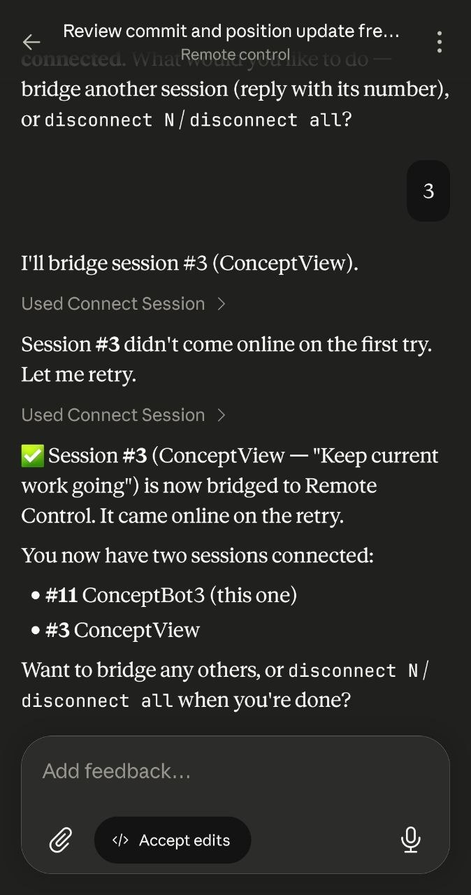

#  ClaudeView

### A fast, native Windows desktop app for the Claude Code CLI

A pleasant three-pane workspace — **chat · file tree · git** — that idles around **~120 MB**
instead of a full editor's 400 MB+. A built-in **Assistant workspace** for general chats, a
**click-to-open context & plan-usage panel**, a **live To-Do panel** that mirrors Claude's task
list, plan-mode approvals, slash-command **and `@`-file**
autocomplete, a file tree that lights up with your git changes, a built-in **syntax-highlighted code
viewer & editor**, a **built-in mockup preview**, inline screenshot paste, **Remote Control from your phone**, an opt-in **Eco token-saving mode**, distinct
**task-done / needs-you alert sounds**, live usage bars, and a tray icon that doubles as a
glanceable usage meter.

&nbsp;

&nbsp;

---

## Why

VS Code's Claude Code extension is great, but it drags a whole editor along with it. ClaudeView is
the opposite: a small, focused window for *talking to Claude Code in a project* — see the files, see
the git state, approve plans, and keep an eye on your usage — without the weight.

## Features

- **💬 Chat with Claude Code** — streamed Markdown (with **tables rendered as a clean bordered grid**), tool calls, tool results, and live to-do checklists. **File paths Claude mentions are clickable, and so is any URL it prints** — even one Markdown's own autolinker skips (like a dot-less `http://localhost:3000/…`) — click straight through to your OS browser. A **Markdown file opens rendered as a styled document** in the preview window — set in the app's own Anthropic type (Serif headings, Sans body, Mono code) with themed scrollbars — not raw text — while **mockups it builds for you open automatically in a fast built-in preview** — an in-app browser window with **Reload**, **Open in browser**, and a **Side by side** button — one click tiles ClaudeView (side panels collapsed) and the mockup across your monitor so you can read the instructions and see the result at once, **the chat re-pinning to the latest as the windows resize** — that shrugs off a page crash and reloads itself. That same in-app browser also opens **images and PDFs Claude links or writes** — click a screenshot or PDF path in the transcript (or "View file" on one in the Git panel) and it shows right there, no OS default app popping up. A tray menu picks how widely it triggers — **only `_mockups` folders · any mockup-named folder · any HTML file · off** — or you can send mockups to your default browser instead; other URLs open in your default browser too. Every code block gets a hover **Copy** button, every response gets a small **copy / jump-to-prompt** action row, and **your own messages get copy *and* edit buttons** — Claude.ai-style throughout. **Edit a message you've already sent to rewind the conversation to that point and re-run from your revised wording** — the earlier branch is copied, not clobbered, so nothing is lost server-side.
- **✨ Built-in Assistant workspace** — a pinned, always-there general-purpose space (under `Documents\ClaudeView`) for quick questions and one-off tasks that aren't a project. It's non-git, defaults to Bypass, and still has **full filesystem access** — point it at any folder on your machine. Its own blue styling keeps it distinct from your projects, and it sits at the top of both the project picker and the sessions list.
- **🔀 Permission modes, one Shift+Tab away** — cycle **Ask before edits · Edit automatically · Plan mode · Auto mode · Bypass permissions** (the same set as Anthropic's official VS Code extension), or click the pill for a one-click picker instead of cycling. New sessions start in **Bypass permissions**, which runs everything without asking.
- **🧠 Model picker that tracks your CLI** — the model dropdown lists exactly what your installed Claude Code offers — Opus, **Sonnet 5**, Fable, Haiku, and Default — with display names and per-model reasoning-**effort** levels pulled straight from the CLI, so a new model shows up the moment you update the CLI, no app update needed. **Each session remembers its own model and effort** — switch sessions and the picker follows, and every session runs (and live-switches) with its own choice. Opus, Sonnet, and Fable run with the **1M-token context window**, and the composer ring shows how much of it you've used — visible at a glance whether or not a turn is running.
- **📊 Context & usage panel** — **hover the context ring for the live window at a glance** (`54.0k / 1.0M · 5%`, plus a **Context reused** line when Eco is on), or **click it for the real `/context` breakdown**: per-category token usage (system prompt · tools · skills · MCP · memory files · messages · free space), a **Context reused** metric (how much of your last turn's input came cheaply from cache instead of being re-sent), plus your **plan-usage bars** (5-hour · weekly) and a one-click **Compact conversation**. **The ring keeps refreshing during a running turn**, not only when it ends. When a compaction finishes — whether you fired it, clicked it, or Eco did — the transcript drops a **"Context compacted · 462K → 58K" receipt** so you can see it worked and how much room it bought, and **the ring refreshes itself** the moment it's done. It reads the live session **token-free** (no wasted message) and even wakes an idle session to show its baseline.
- **🍃 Eco mode** — a one-tap composer toggle (left of the model picker) that switches on a **token-saving suite**: it **hands heavy multi-file exploration to isolated same-model subagents** that report back a summary (keeping your main context lean), **eases both the reasoning effort *and* the model on trivial turns** — dropping a model tier (e.g. Opus → Sonnet) on acknowledgements, `/commit`, `/push`, and other short mechanical commands, then restoring your full model and effort on the next real message (a green ring on the model picker marks a turn that ran cheaper) — **trims MCP servers and skills you aren't using this session**, **head-and-tail-truncates oversized tool output** before it bloats the context, **keeps user-facing prose lean** (trimming filler, preamble, and end-of-task narration without touching reasoning depth or verification), and **nudges you to clear or fork** when a big context meets an unrelated new task. It also **auto-compacts a filling context — but only before your next message, never in the middle of active work** — so a long autonomous run keeps full fidelity. The trigger **adapts to how fast your context is growing** — sooner on an active, still-climbing session where the per-turn savings compound, later on one that's winding down and wouldn't earn the summary back — and every auto-compaction is **steered to keep your live working set** (recent turns, open files, the active goal, unresolved decisions) in full while condensing only the older, finished material, so it frees space without dropping what you're actually using.
- **📥 Never blocked on send** — type your next message while Claude is still working and it queues as an editable, numbered chip instead of waiting; it fires the moment the turn ends. Press **Enter** again to force it out immediately instead of waiting, or pull it back into the composer to revise it first.
- **✍️ A composer that keeps up** — **Zed-style numbered lists** (type `1. ` or `1) ` and the markers snap to fixed-width mono + accent so every item lines up, while your text stays regular; `Shift+Enter` continues the list in whichever style you started, and ends it on an empty item), and **your unsent draft — text and pasted images alike — survives session switches, restarts, and even a crash**. **Sending always scrolls you to the bottom** — even with a tall pasted screenshot in the mix — so the new message never ends up cut off below the fold.
- **⚡ Quick commands** — one-click buttons in the composer for the things you send constantly (**Continue · Commit · Push** out of the box), each firing its command the moment you click it. **Add, rename, reorder, or remove your own** from a small manager, while the keyboard-shortcut hints tuck behind a **?** so the row stays clean.
- **🔴🟢 Inline diffs** — Edit/Write/MultiEdit tool calls show a real red/green line diff right inside the tool card, not just a filename.
- **⏱️ Never wonder if it's stuck** — the working indicator shows elapsed time and *what* Claude's currently running (e.g. "Editing Foo.cs · 12s"), not just three dots.
- **🛰️ Remote Control** — hand any session off to your phone or claude.ai: flip it on and ClaudeView opens the session link and keeps the transcript **in sync both ways**, so messages you type on your phone show up here (and vice-versa). **Bridge as many sessions as you like at once** — each marked with a violet indicator. Then drive it all from your phone: type **`/remote`** to list every session on that computer, **connect** another one, or **disconnect** any of them (or all) — no need to walk back to the desktop. A bridge drops when you close the window, but **survives an app update or restart** — ClaudeView re-establishes it automatically when the session comes back, so a background update never silently strands your phone. An idle bridged session shows a **dimmed** violet dot (it only pulses while actually working).
- **📋 Plan mode, clickable** — `AskUserQuestion` renders as selectable option cards, each **labeled "Choose one" or "Choose any"** so you know at a glance whether it's single- or multi-select before you start clicking, and — just like Anthropic's official VS Code extension — **every question also carries an "Other" field so you can type your own answer when none of the choices fit** (mix a typed answer on one question with picks on the rest); `ExitPlanMode` as an **Approve / Reject** card. Reject → edit → re-present works end to end. The cards **wait as long as you need** — take an hour to decide and the turn stays parked for your answer, never timing out behind your back — and **a question can't get lost behind Claude's own work**: background exploration streaming underneath it never clears the "waiting on you" state, and if the card scrolls out of view a **"Claude needs input" pill** appears at the top of the transcript to take you straight back to it.
- **⌨️ Slash commands** — `/` autocomplete over built-ins *and* your own `.claude/commands` and skills — icon-coded so you can tell Anthropic built-ins from your own at a glance — with descriptions **and argument hints** pulled from their frontmatter. No-arg builtins submit on select; fires mid-message too, not just at the start.
- **🔎 `@`-mention files** — type `@` for an inline, filter-as-you-type file picker (Zed-style). Arrow-keys / Tab to insert a path reference into your message. Or right-click any file → **Reference in chat**.
- **📎 Attach & drop** — attach a file with the paperclip button or drag it straight onto the composer; images become inline thumbnails, everything else becomes a reference Claude can read.
- **🗂️ File tree as a change-radar** — lazy-loaded and **tinted live by git status** (green = new · yellow = modified · red = deleted), with a dot on folders that contain changes. **Double-click any file to open it in the built-in code viewer/editor**; right-click for Reference in chat · View diff · View · Open · Reveal in Explorer · Open terminal here · Copy path · **Add to `.gitignore`**. It **refreshes itself the moment Claude creates or deletes a file**, and you can **drag any file straight into the composer** to reference it.
- **📝 Built-in code viewer & editor** — double-click any file to open it in a themed, **syntax-highlighted** viewer (~40 languages) topped with a **colored brand-logo badge** for the file's language — no more launching an external app just to glance at a file. Click **Edit** to turn it into a full editor powered by **CodeMirror 6**: line-number gutter, undo/redo, **find/replace**, multi-cursor, auto-indent, and bracket matching — save with **Ctrl+S**. **Ctrl+A selects the whole file** so you can copy it straight out, even in read-only view. **Markdown and HTML files get a Preview toggle** — flip between the source and a styled rendered view right in the window, reflecting your unsaved edits. It opens **read-only by default** and stays safe alongside a live session: it silently reloads when a file changes on disk while you're just viewing, **warns before overwriting** a file Claude changed, and preserves your original line endings.
- **🖼️ Inline screenshot paste** — paste an image straight into the composer (Zed-style); hover a thumbnail to enlarge.
- **🔀 Git panel** — status, colored changes, history, and one-box commit (Enter to commit); auto-refreshes after each turn. A **contextual sync button** does the right thing for your branch — **Push · Pull · Sync · Fetch** — with a caret for the full menu (fetch, pull, rebase-pull, push, force-push), and **every action reports back with a green ✓ or red ✗** — git's raw output flattened to one clean line beneath (**hover for the full message, clear it with a click**) instead of a ragged multi-line dump. The **history reads like a graph, VS Code-style** — a connecting line threads the commits, HEAD is a hollow ring, your current branch shows as a pill, and a **cloud marks the exact commit your remote is synced to**, so a glance tells you what's already pushed and what's still local (commits above the cloud glow in the accent color). **Hover any commit for a rich card**: the author and any co-authors, each with their own avatar — the email-domain favicon for people, the Claude mark for Claude — plus the full message (with `- ` lists rendered as real bullets) and push state. **Click a changed file to reveal it in the tree and open its diff** — a tinted, side-bar diff view with colored `+`/`−` lines. It also **spots a placeholder commit identity** (like `Your Name <you@example.com>`) and offers to set your real name and email in one click — pre-filled from your signed-in Claude account, for this repo or globally — so your commits are attributed correctly. Not a repo yet? **Initialize one in a click.**
- **🔭 Sessions** — multiple concurrent conversations per project, with a working/awaiting/idle indicator, per-session cost, and how long ago it last ran (hover for the exact time). **Ctrl+1‑9 / Ctrl+Tab** jump straight to a session, **`+` on any group starts a new one**, **↻ starts a project fresh** (clears all its sessions and opens a clean one in a click), and you can **pin the projects you live in to the top** of the list. **A native toast — with a distinct sound — tells you when a task finishes** (a gentle chime) or **needs your input** (an insistent, looping alert), while ClaudeView is unfocused, minimized, or closed to the tray. **Right-click any group header to recall a session that isn't listed** — reopen a past conversation still on disk, matched back to its project (most resolve automatically; assign a project to the rest), transcript and resume point intact.
- **✅ Live To-Do panel** — when Claude tracks its work as a task list, it gets its own panel pinned under Sessions and **mirrors that list in real time**: items check off as Claude completes them, the one **currently in progress is marked with a gently breathing Claude logo** so you can see what's being worked on at a glance, topped with an *X of Y done* progress bar. It **appears only when there's a list** (and hands the space back to Sessions otherwise), and the divider between the two **drags to resize · double-clicks to reset**, remembered across restarts.
- **🎨 Theming** — Light / Dark / **System** (follows Windows), switching the chrome, the transcript, *and* the context menus together; immersive dark title bar, set throughout in Anthropic's own **Sans / Serif / Mono** typefaces.
- **📊 Usage at a glance** — status-bar 5h / 7d limit bars, session cost, model, and live RAM.
- **🧾 Billable hours, derived from your own transcripts** — turn the time you actually spend with Claude into an invoiceable number, per project, with **zero manual timers**. ClaudeView reads the Claude CLI's own logs (**read-only — it never writes to `~/.claude`**), tells **real human turns from tool-results**, clusters them by idle gap, and **bridges adjacent clusters only when ClaudeView's own presence heartbeats show you were actually there** across the gap — so a coffee break doesn't get billed but a long think does. Because it's derived from logs already on disk, **switching a project on backfills its entire history instantly** — there's no "starts counting from today". It surfaces as a **sidebar card** (the period's total plus an activity spark that **spans whatever you're viewing** — a week's days, a month's days, or the project's months) and a **timeline window** where you **hover any block for its span and source sessions, click to exclude it, add a manual entry for work away from Claude, then approve & lock the period** into a snapshot that later recalculations can never move. **Claude writes the invoice line itself** — one click turns the period's commits *and* the prompts you actually typed into the 1-3 sentences you send the client, on an isolated cheap-model call that never touches your live session. **All-time** reports your **averages per day, week and month** (over the periods you actually *worked*, not calendar periods, so a project with gaps isn't called idle). **Export** to clipboard, CSV or JSON with **a row per work block** — date, span, hours, source sessions — plus manual entries and a tagged total. Bill by **week, month, or all-time**, per project; every view agrees, because one ledger computes the totals and rounds them up to the quarter-hour in exactly one place.
- **🛎️ Tray meter** — the tray icon *is* a live usage bar chart: 5-hour, weekly, and a **configurable third bar** you pick from **Disk · RAM · CPU · App RAM** right from the menu — and its **hover tooltip carries the same three rows** (with **App RAM** showing the exact MB ClaudeView is using). Single-click for a **usage popup** (now with a live **CPU** row and your core count), double-click to restore the window, right-click for a menu (third-bar metric, update frequency, close-to-tray, start with Windows, and **billable-hours presence tracking** with its gap ceiling).
- **🪟 Polished window** — a **responsive collapsing layout** that folds the side panels away as it narrows (down to a phone-width single column), with its **own chat font size for the compact view** kept separate from your desktop size. It restores its size/maximized state, scroll-follows-cursor across panels, and **double-click any panel splitter to reset it**. Panel widths *and* the Explorer/Git and Sessions/To-Do splits are **remembered across sessions and restarts**, and the **Git, Billing, and To-Do cards each fold down to a header-only strip with one click of their header caret** — click it again to bring the card right back — so one you don't need right now doesn't cost you screen space. **The window stays live and interactive even through the heaviest streaming turns** — chat updates are drained in the background so a busy turn never freezes your scrolling or clicks, and **your transcript is saved off the UI thread**, so a session with thousands of messages keeps scrolling smoothly while it's being written to disk.
- **🛡️ Subscription-safe — never bills your API account** — ClaudeView runs on your Claude **subscription**, full stop. Even if your machine has an `ANTHROPIC_API_KEY` (or a Bedrock/Vertex/base-URL override) set for other tools, ClaudeView **strips it from every process it launches** so the CLI can *only* use your subscription — it can never silently drain pay-per-token API credits. If you aren't signed in, it **opens the sign-in flow for you** — the same one-click console sign-in as the tray menu, and typing **`/login`** in the composer launches it too — instead of quietly spending money or dead-ending on a "`/login` isn't available here" error, and it shows a one-time notice whenever it detects and ignores a key.
- **🔒 Hardened against what Claude reads** — everything in the transcript is treated as untrusted, because it's downstream of whatever Claude last opened: a repo file, a fetched page, a tool result. Markup a model writes is **rendered as text, never as live HTML**, so a hostile repository can't plant content that runs inside the app; link destinations are limited to real web addresses; and **opening a file never runs it** — an executable or script Claude points you at opens in the built-in code viewer, or gets revealed in Explorer, instead of being handed to Windows to launch.
- **🛟 Resilient** — transient failures don't derail you. When a turn hits an **`Overloaded` (529), rate limit, usage cap, or dropped connection**, ClaudeView **auto-recovers** — it backs off and retries on its own instead of making you type "continue" — and a **529 instantly tells you whether it's you or Anthropic**: an inline line quotes Anthropic's own incident message when the [status page](https://status.claude.com) reports one, while a **quiet status dot in the footer** lights up and labels any outage at a glance. If the underlying CLI ever crashes mid-turn, ClaudeView explains what happened in plain language (not a raw stack trace) and **resumes your conversation on the very next message** instead of hanging or losing it. It also **sizes the CLI's memory to your machine** — capped so it never starves Windows itself — so long, heavy sessions have the headroom to keep going, and **compacts a dangerously-full context on its own before it can crash** rather than letting the CLI run out of memory mid-turn. And when your **usage limits reset — especially an early, unscheduled reset** — a toast lets you know you're back in business, with a link to [@ClaudeDevs](https://x.com/ClaudeDevs) for the details. **Your session list itself is crash-proof** — if the file that tracks your sessions is ever lost to a hard crash, ClaudeView **rebuilds it from the transcripts still on disk** on the next launch, recovering each session's project and resume point (from the Claude CLI's own logs) so your sidebar is never silently emptied. The **built-in browser engine self-heals**, too: a WebView2 runtime corrupted by a system crash offers a **one-click repair** in place of a cryptic `0x8000FFFF` dialog, and a browser-process crash recovers without bricking the window. And when an **Edge/WebView2 runtime update itself is the problem** — some builds crash on older GPUs over Remote Desktop — ClaudeView can run on a **pinned, known-good runtime** instead of the auto-updating one, switchable from the tray, so a bad Microsoft update can't take the app down.
- **♻️ Auto-updating** — self-installs to `%LOCALAPPDATA%`, then updates from GitHub Releases (download → **verify SHA-256** → swap on next launch), and the first time a freshly-updated build starts it shows a **"What's New" card** summarizing the release — reopen it any time from the tray menu.

|  Dark mode  |  Tray usage meter  |
| :---------: | :----------------: |
|  |  |

**🛰️ Drive every session from your phone** — type **`/remote`** to list the sessions running on that
computer, then **connect** (bridge) or **disconnect** any of them from anywhere.

## Install

1. Download **`ClaudeView.exe`** from the [latest release](https://github.com/Concept211/ClaudeView/releases/latest).
2. Run it. On first launch it copies itself to `%LOCALAPPDATA%\ClaudeView`, extracts its bundled
   sidecar, adds Desktop + Start-Menu shortcuts, and relaunches from there. After that it
   auto-updates itself.
3. **First-run setup checks your prerequisites and installs what's missing for you** — no manual
   `npm install` required. When it's done, click **Start using ClaudeView**.

|  Auto-installs prerequisites  |  Ready to go  |
| :---------------------------: | :-----------: |
|  |  |

**Requirements:** Windows 10/11. ClaudeView installs [Node](https://nodejs.org) and the
[Claude Code CLI](https://docs.claude.com/en/docs/claude-code) (`claude`) on first run if they aren't
already present — you just need to be **signed in to Claude** (the app can drive the CLI's sign-in for
you). ClaudeView always uses that **subscription** — never a pay-per-token API account, even if you
have an `ANTHROPIC_API_KEY` set on your machine. The WebView2 runtime ships with modern Windows/Edge.

## How it works

A native WPF (.NET 8) shell renders the chat in WebView2 and drives the installed Claude Code CLI
through a small Node sidecar (the official `@anthropic-ai/claude-agent-sdk`). The SDK handles the
parts the raw stream protocol can't — like answering plan-mode questions reliably.

---

Free to download and use. Built on Anthropic's
[Claude Agent SDK](https://github.com/anthropics/claude-agent-sdk-typescript) — not affiliated with
or endorsed by Anthropic.

