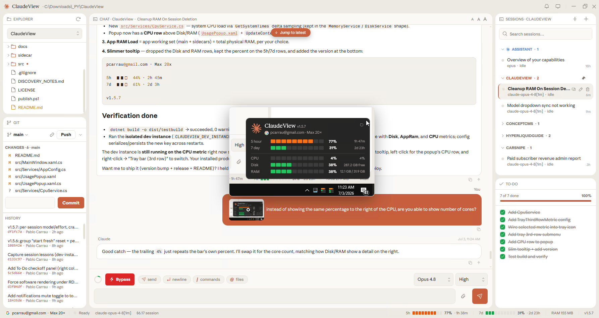
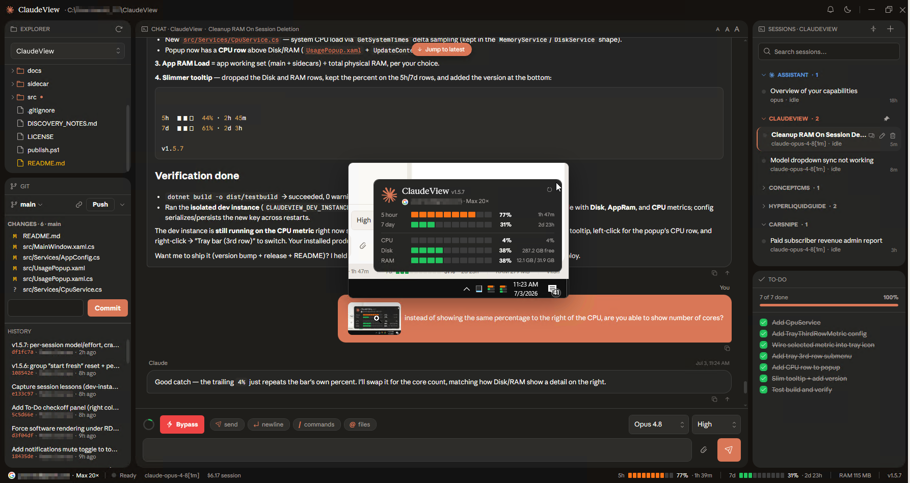
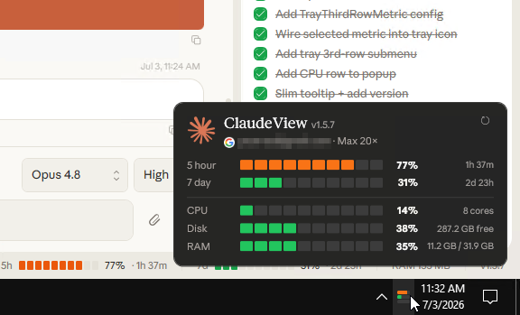
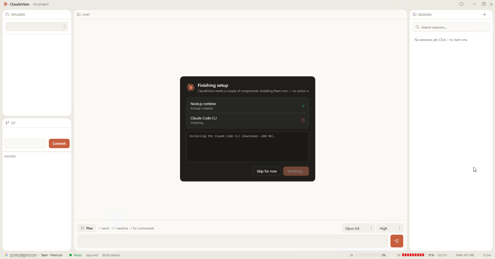
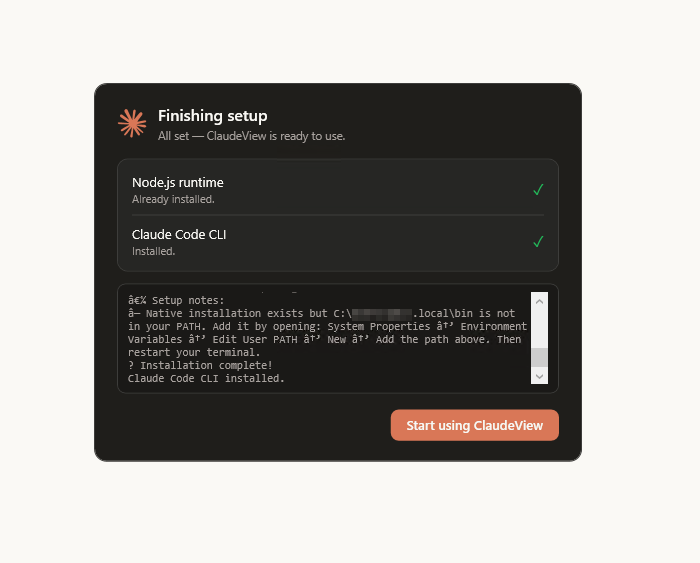

# ✳️ ClaudeView

### A fast, native Windows desktop app for the Claude Code CLI

A pleasant three-pane workspace — **chat · file tree · git** — that idles around **~120 MB**
instead of a full editor's 400 MB+. Plan-mode approvals, slash-command **and `@`-file** autocomplete,
a file tree that lights up with your git changes, inline screenshot paste, live usage bars, and a
tray icon that doubles as a glanceable usage meter.

&nbsp;

&nbsp;

---

## Why

VS Code's Claude Code extension is great, but it drags a whole editor along with it. ClaudeView is
the opposite: a small, focused window for *talking to Claude Code in a project* — see the files, see
the git state, approve plans, and keep an eye on your usage — without the weight.

## Features

- **💬 Chat with Claude Code** — streamed Markdown, tool calls, tool results, and live to-do checklists.
- **📋 Plan mode, clickable** — `AskUserQuestion` renders as selectable option cards; `ExitPlanMode` as an **Approve / Reject** card. Reject → edit → re-present works end to end.
- **⌨️ Slash commands** — `/` autocomplete over built-ins *and* your own `.claude/commands` and skills, with descriptions pulled from their frontmatter. No-arg builtins submit on select.
- **🔎 `@`-mention files** — type `@` for an inline, filter-as-you-type file picker (Zed-style). Arrow-keys / Tab to insert a path reference into your message. Or right-click any file → **Reference in chat**.
- **🗂️ File tree as a change-radar** — lazy-loaded and **tinted live by git status** (green = new · yellow = modified · red = deleted), with a dot on folders that contain changes. **Single-click a changed file to see its diff**; right-click for Reference in chat · View diff · Open · Reveal in Explorer · Open terminal here · Copy path.
- **🖼️ Inline screenshot paste** — paste an image straight into the composer (Zed-style); hover a thumbnail to enlarge.
- **🔀 Git panel** — status, colored changes, history, and one-box commit (Enter to commit); auto-refreshes after each turn. Not a repo yet? **Initialize one in a click.**
- **🔭 Sessions** — multiple concurrent conversations per project, with a working/awaiting/idle indicator and per-session cost.
- **🎨 Theming** — Light / Dark / **System** (follows Windows), switching the chrome, the transcript, *and* the context menus together; immersive dark title bar.
- **📊 Usage at a glance** — status-bar 5h / 7d limit bars, session cost, model, and live RAM.
- **🛎️ Tray meter** — the tray icon *is* a live usage bar chart. Single-click for a usage popup, double-click to restore the window, right-click for a menu (update frequency, close-to-tray, start with Windows).
- **🪟 Polished window** — responsive collapsing layout, restores its size/maximized state, scroll-follows-cursor across panels.
- **♻️ Auto-updating** — self-installs to `%LOCALAPPDATA%`, then updates from GitHub Releases (download → **verify SHA-256** → swap on next launch).

|  Dark mode  |  Tray usage meter  |
| :---------: | :----------------: |
|  |  |

## Install

1. Download **`ClaudeView.exe`** from the [latest release](https://github.com/Concept211/ClaudeView/releases/latest).
2. Run it. On first launch it copies itself to `%LOCALAPPDATA%\ClaudeView`, extracts its bundled
   sidecar, adds Desktop + Start-Menu shortcuts, and relaunches from there. After that it
   auto-updates itself.
3. **First-run setup checks your prerequisites and installs what's missing for you** — no manual
   `npm install` required. When it's done, click **Start using ClaudeView**.

|  Auto-installs prerequisites  |  Ready to go  |
| :---------------------------: | :-----------: |
|  |  |

**Requirements:** Windows 10/11. ClaudeView installs [Node](https://nodejs.org) and the
[Claude Code CLI](https://docs.claude.com/en/docs/claude-code) (`claude`) on first run if they aren't
already present — you just need to be **signed in to Claude** (the app can drive the CLI's sign-in for
you). The WebView2 runtime ships with modern Windows/Edge.

## How it works

A native WPF (.NET 8) shell renders the chat in WebView2 and drives the installed Claude Code CLI
through a small Node sidecar (the official `@anthropic-ai/claude-agent-sdk`). The SDK handles the
parts the raw stream protocol can't — like answering plan-mode questions reliably.

---

Free to download and use. Built on Anthropic's
[Claude Agent SDK](https://github.com/anthropics/claude-agent-sdk-typescript) — not affiliated with
or endorsed by Anthropic.

